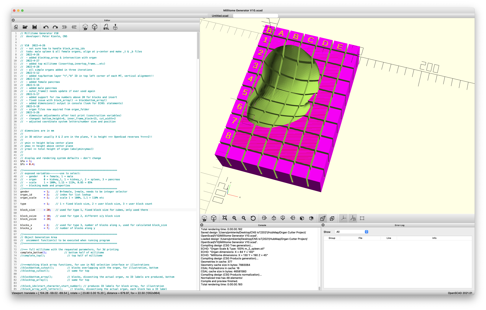
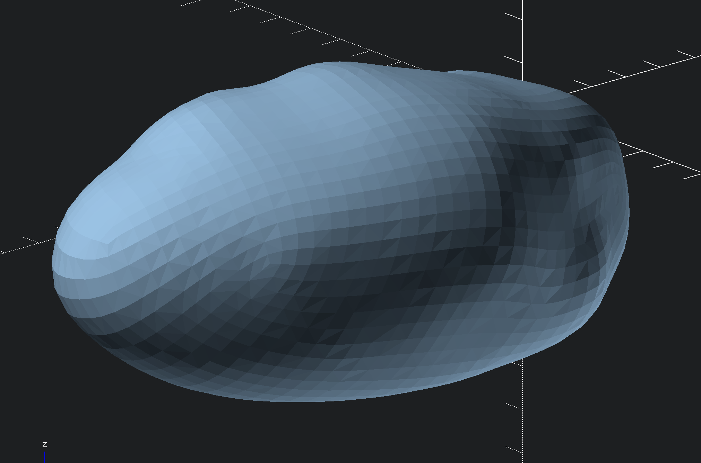
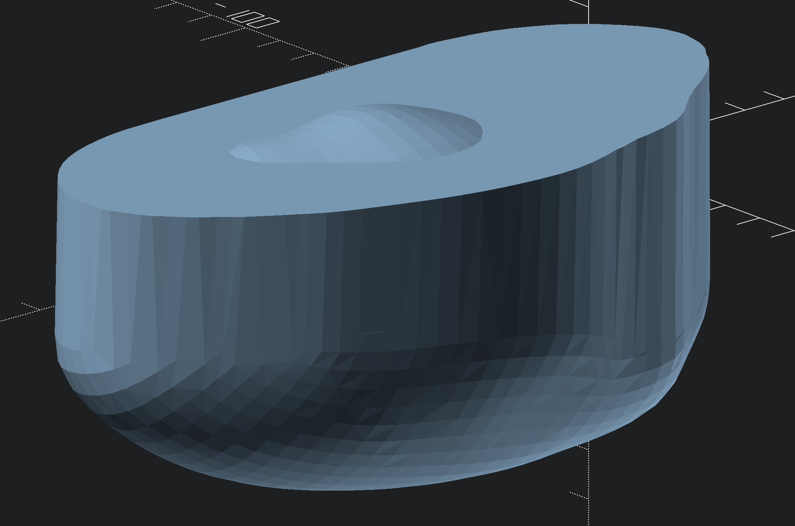
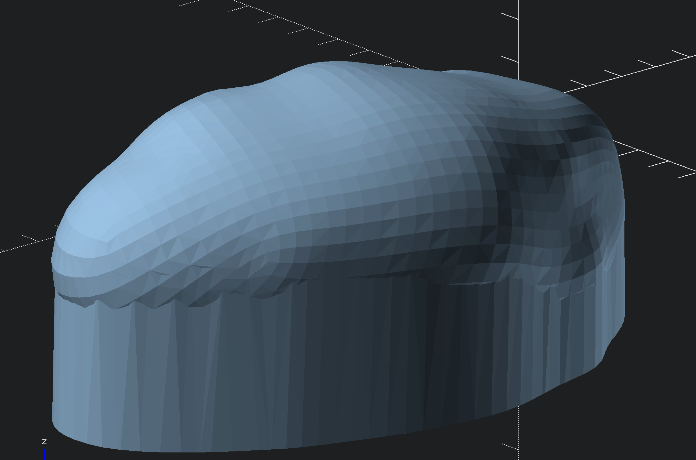

# Millitome Generator V10

Implemented in OpenScad 2021.1. 

<h3>Customization variables</h3>
<h4>Organ selection</h4>

gender:  
0 = female 
1 = male 

organ_id: 
0 = kidney_l 
1 = kidney_r 
2 = spleen 
3 = pancreas 

organ_scale: 
1 = 100% 
1.15 = 115% 
0.85 = 85% 

<h4>Blocking mode and properties</h4>
type: 
1 = fixed block size, length & width are equal 
2 = user block size, length & width are different 
3 = user block count, count of blocks along length & width  

block_size: 
in millimeters, used for type 1, all blocks are equal length & width 

block_xsize, block_ysize: 
in millimeters, used for type 2, length & width are different 

blocks_x: 
used for type 3, number of blocks along X (width), number of blocks = full organ width/blocks_x 
blocks_y: 
number of blocks along Y (length) 

<h3>Object generation functions</h3>

These functions are in the Object Generation Area. To generate exportable geometry from OpenScad, uncomment any of the functions in the list below. Click the Preview button for quick preview. Click the Render button to generate geometry then Export As STL. 

<h4>full millitome with the requested parameters, for 3d printing</h4>

> complete_bottom();  // bottom half of millitome
> 
> complete_top();   //top half of millitome

<h4>matching block array functions, for use in RUI selection interface or illustrations</h4>

> blockbottom_cutout();    // blocks overlapping with the organ, for illustration, bottom
> 
> blocktop_cutout();    // same for top
> 
> blockbottom_array();    // blocks, dissecting the actual organ, no ID labels are produced, bottom
> 
> blocktop_array();    // same for top  
> 
> block_ids(start_character,start_number);    // produces ID labels for block array, for illustration
> 
> block_array_with_letters();    // blocks, dissectiong the actual organ, each block has a ID label

<h4>often used components</h4>

> insert();    // area immediately surrounding the organ, with organ mold
> 
> inserttop();    // same for top
> 
> inner_frame_with_letters();    // enclosure around insert, with column/row identifiers on each block
> 
> innertop_frame_with_letters();    // same for top,row of letters if reverse
>
> outer_frame();    // outer frame, with cutting slots, higher than inner frame, not really necessary

<h4>display of organ percentage user setting, organ name & size, millitome dimensions in console (look for ECHO:)</h4>

> dimensions(); 

<h4>shows the 3d model of the used organ for reference</h4>

> organ();

<h4>following functions produce individual components; for documentation, etc, makes it easier to texture</h4>

> inner_frame();    // inner frame (enclosure) around insert, no col/row IDs are produced
> 
> innertop_frame();    // same for top
> 
> insert_frame();    // mold cutout without slots
> 
> inserttop_frame();    // same for top
> 
> letter_array(start_character);    // produces the column IDs (letters A,B,C.....) for inner frame
> 
> lettertop_array(start_character);    // same for top
> 
> number_array(start_number);    // produces the row IDs (numbers 1,2,3,4....) for inner frame
> 
> numbertop_array(start_number);    // same for top
> 
> layer_info_top();    // produces "t" identifier in top layer
> 
> layer_info_bottom();    // produces "b" identifier in bottom layer

<h4>basic components, for debugging and documentation</h4>

> column_slot_array();    // virtual blades cutting column slots in all components which need them
> 
> row_slot_array();    // virtual blades cutting row slots in all components which need them
> 
> organ_top();    // organ to cut the top half, extended on bottom, used for mold cutting
> 
> organ_bottom();    // same for top
> 
> inner_box_cut();    // makes the hole in inner_frame()
> 
> innertop_box_cut();    // same for top
> 
> inner_box_hollow();    // inner frame without cutting slots
> 
> innertop_box_hollow();    // same for top
> 
> outer_box_hollow();    // outer frame without cutting slots, probably not used

<h4>most basic components, just boxes for various components</h4>

> outer_box();    // dimensions of outer frame box (type dependent)
> 
> bounding_box();    // box enclosing the organ exactly
> 
> insert_box();
> 
> inserttop_box();
> 
> inner_box();    // box for inner part
> 
> innertop_box();    // same for top
> 
> blockbottom_box();    // dimensions of block array box (type dependent)
> 
> blocktop_box();    // same for top

# Folder Contents

There are three STL files for each organ:

Edited, simplified geometry of left female kidney: 
<em>f_0_kidney_l.stl</em> 

Model with straight extended top; used to cut bottom molds: 
<em>_bf_0_kidney_l.stl</em> 

Model with straight extended bottom; used to cut top molds: 
<em>_tf_0_kidney_l.stl</em> 

