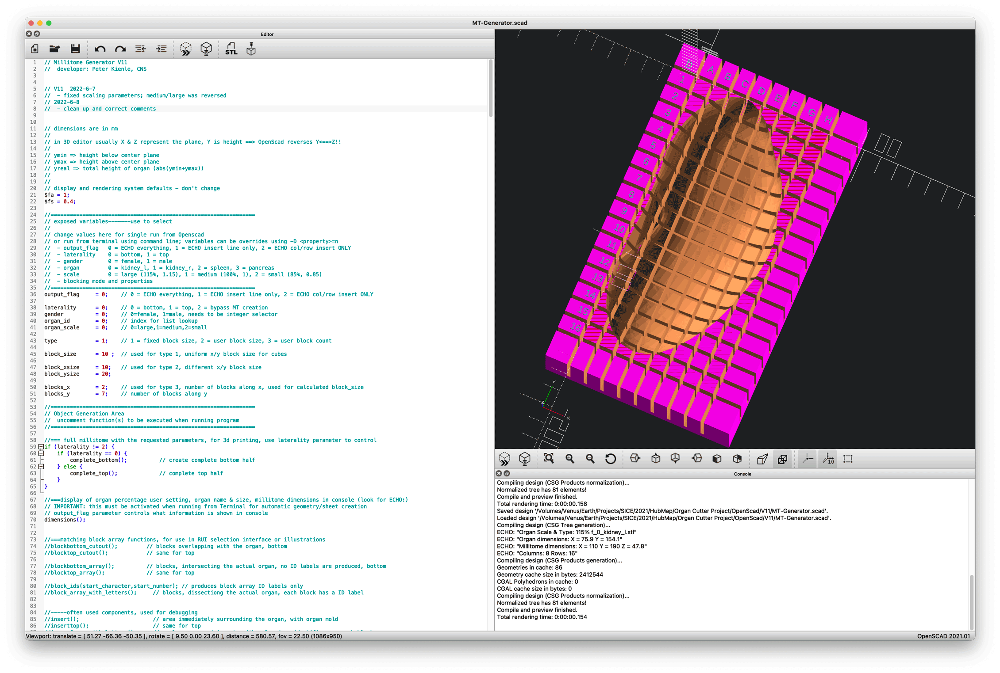
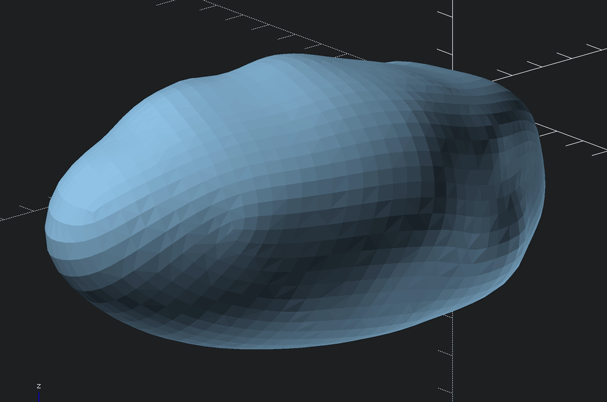
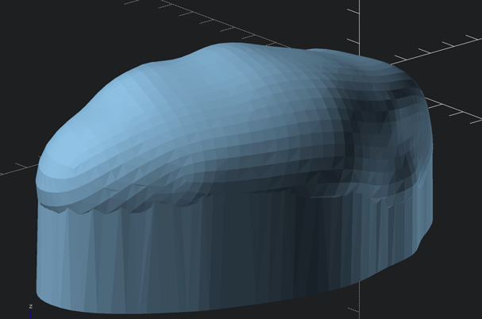
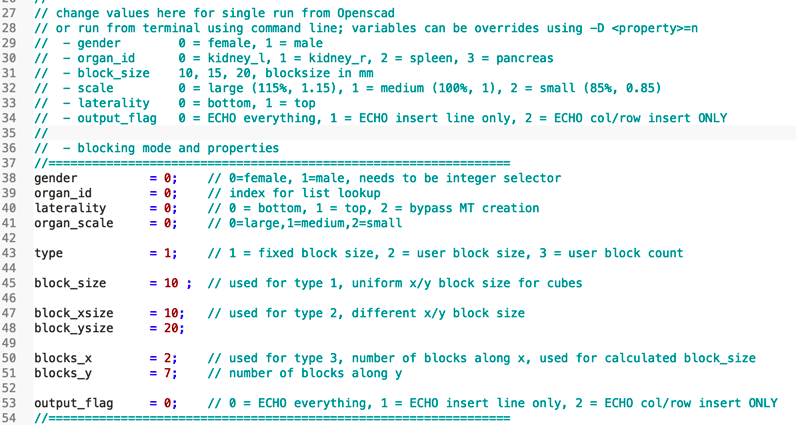
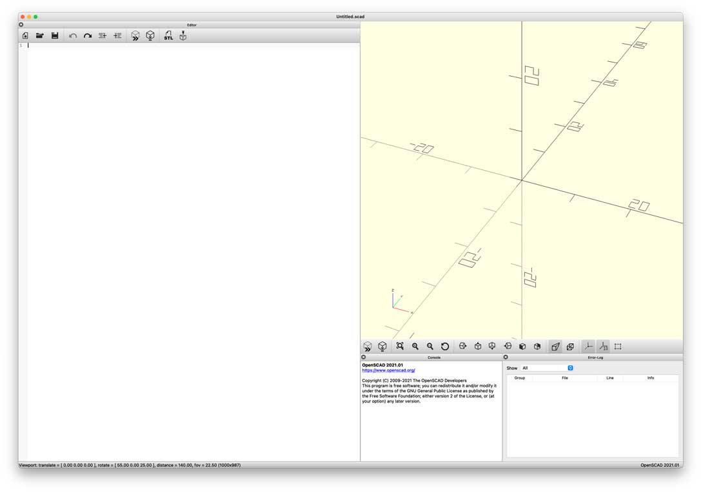
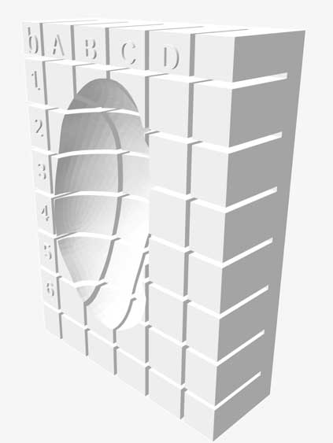
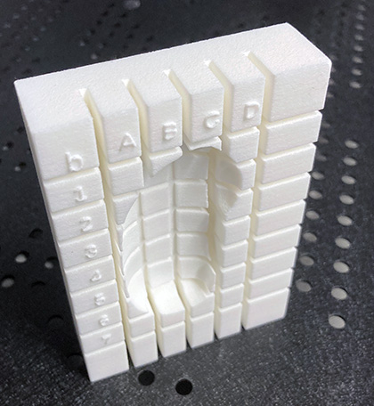
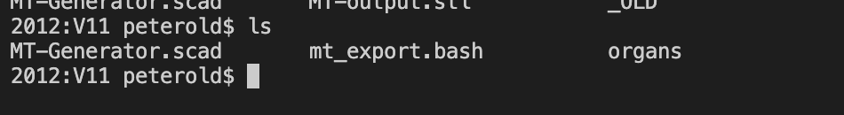
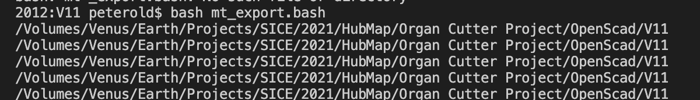
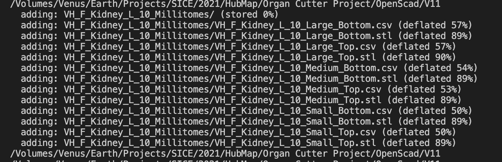

# Millitome Generator V11

  

  Fig.1 Millitome Generator V11 running in OpenScad software

## Table of Contents

- [Requirements](#requirements)
- [Folder Contents](#folder-contents)
- [Operating Instructions](#operating-instructions)
  - [Customization Properties](#customization-properties)
  - [Millitome Generation from Openscad](#millitome-generation-from-openscad)
  - [Millitome Generation using Terminal Commands](#millitome-generation-using-terminal-commands)
  - [Millitome Generation using Terminal Script](#millitome-generation-using-terminal-script)
    - [Running the Terminal Script](#running-the-terminal-script)
    - [Closer Look at the Terminal Script](#closer-look-at-the-terminal-script)

# Requirements

Implemented in [OpenScad 2021.01](https://openscad.org). Developed on MacOS 12.4.
[Successfully tested on Raspberry Pi 4 running Raspberry Pi OS (64-bit)](https://github.com/hubmapconsortium/hra-millitome-generator/blob/e3ca6c1f054a2bb00257ef67d6a17d013c5d8c42/OpenScad%20Code/V11/Raspberry%20Pi%204%20Installation.md).

Proper installation requires these items in the same directory location:

**organs** (folder)\
**MT-Generator.scad** (program code to run in Openscad)\
**mt_export.bash** (bash shell script)

In addition the [Openscad](https://openscad.org) application must be installed on the computer and configured for [command line access](https://en.wikibooks.org/wiki/OpenSCAD_User_Manual/Using_OpenSCAD_in_a_command_line_environment).

# Folder Contents

#### [images](https://github.com/hubmapconsortium/hra-millitome-generator/tree/main/OpenScad%20Code/V11/images)
This folder contains images used for documentation. Not required for proper operation of *MT-Generator*.

#### [organs](https://github.com/hubmapconsortium/hra-millitome-generator/tree/main/OpenScad%20Code/V11/organs)
Contains 24 files in STL format, used by *MT-Generator* to cut the correct mold shapes. This folder must reside in the same directory from which *MT-Generator.scad* is launched.

There are three STL files for each organ:

Edited, simplified geometry of left female kidney:\
[*f_0_kidney_l.stl*](https://github.com/hubmapconsortium/hra-millitome-generator/blob/7fc45ea5e9f6eb0297473e38da1884ab637b68ce/OpenScad%20Code/V11/organs/f_0_kidney_l.stl)\

Model with straight extended top; used to cut bottom molds:\
[*_bf_0_kidney_l.stl*](https://github.com/hubmapconsortium/hra-millitome-generator/blob/646edafee4bd8995ceebeda2937633f550995781/OpenScad%20Code/V11/organs/_bf_0_kidney_l.stl)\

Model with straight extended bottom; used to cut top molds:\
[*_tf_0_kidney_l.stl*](https://github.com/hubmapconsortium/hra-millitome-generator/blob/646edafee4bd8995ceebeda2937633f550995781/OpenScad%20Code/V11/organs/_tf_0_kidney_l.stl)\

#### [MT-Generator.scad](https://github.com/hubmapconsortium/hra-millitome-generator/blob/d9b2529c8e3caacc66053ad367b275fbb6c62047/OpenScad%20Code/V11/MT-Generator.scad)
Program code to be run in Openscad.

#### [mt_export.bash](https://github.com/hubmapconsortium/hra-millitome-generator/blob/d9b2529c8e3caacc66053ad367b275fbb6c62047/OpenScad%20Code/V11/mt_export.bash)
Terminal script file to run <em>MT-Generator</em> automatically from bash terminal.

# Operating Instructions 

*MT_Generator.scad* is a text based code file. When double-clicked, it will launch the Openscad 3d graphics application and display the program code, a text console and a preview of the model produced by the code. Rendering the current model will produce the actual 3d geometry, which can then be exported as an STL file. While the *MT_Generator* code internally uses many discreet 3d objects, such as boxes, letters and the simplified organ model in order to assemble the requested millitome, the exported STL file contains only one single 3d object.

## Customization Properties

Properties for specific millitomes are determined by a short list of parameters at the top of the *MT_Generator.scad* code. Each of these parameters can be modifed and Openscad will show a preview of the resulting millitome after saving the code file or initiating a refresh of the preview. All properties are defined as integers:

**gender**\
0=female, 1=male

**organ_id**\
0=left kidney, 1=right kidney, 2=spleen, 3=pancreas

**block_size**\
10, 15, 20 (size of one sample block in millimeters)

**organ_scale**\
0=large (115%), 1=medium (100%), 2=small (85%) (to account for size variations in organ samples)

**laterality**\
0=bottom, 1=top

## Millitome Generation from Openscad

In the Openscad code editor navigate to the lines shown. Edit the parameters as required. *Save* the modified code and see updated preview. *Render* to create exportable geometry. When satisfied *Export STL*. 

  

  Fig.2 2D Millitome Generator configuration properties.

## Millitome Generation using Terminal Commands

[This webpage](https://en.wikibooks.org/wiki/OpenSCAD_User_Manual/Using_OpenSCAD_in_a_command_line_environment) explains how to set up command line access to Openscad on Windows and MacOS.
All following instructions assume Openscad can be accessed in the terminal by typing "openscad" at the command prompt, followed by the *Return* key . 
  
To test:
Launch the terminal app. At the prompt type:\
*openscad*

If everything is properly set up, the Openscad application will launch without loading a file.

  

  Fig.3 Openscad opened from bash shell.

In order to make Openscad export a millitome of a specific type the command line has to include information about the Openscad source code file, the name of the STL file to be created, and properties of the requested millitome:

*openscad MT-Generator.scad -o MT-output.stl -D laterality=0 -D gender=0 -D organ_id=1 -D organ_scale=1 -D block_size=20*

This command line will create an output file, "MT-output.stl", in the working directory. This millitome will be the "bottom" for a "female" "kidney right" scaled to 100% with a block size of 20mm. The "-D" option forces Openscad to override a named variable defined in the code file. Variables not explicitly overridden will use the default values defined in the Openscad code. 

  
    
    
  

  Fig.4 Millitome 3d model (left) and 3d-printed (right).

## Millitome Generation using Terminal Script

Both previous methods of millitome generation produce one single STL file per run. One full set of millitomes for a specific organ and sample block size contains six individual STL files. This is to account for organ size variations and laterality. With four distinct organs and two genders the total number of exported STL files comes 144! Depending on the configuration properties of the millitome it takes about one to five minutes for Openscad to render and save one STL file. Every STL file must be saved using a very specific filename and sorted into a folder hierarchy. It is a perfect task for a script.

### Running the Terminal Script

Make sure the terminal is pointing to the correct working directory and that you have the required user priviliges. These three items must be present in the working directory:

*MT-Generator.scad*\
*mt_export.bash*\
*organs*

At the prompt enter this command:\
*bash mt_export.bash*

The script will create an *exports* folder and a subfolder for the first millitome set. A file called *_logfile.txt* will appear in the working directory. This logfile is used by the script to parse console output. 

While the script is running, text output in the terminal console will show the working directory and the name of the last created millitome.

Every time the script has created all six STL files and matching CSV files for a specific millitome, the folder is compressed into a ZIP file and the source folder is deleted.

In total 24 ZIP files will be created inside *exports*. Each ZIP file contains six STL files and six CSV files. Expect this to take several hours. The script can be stopped from the terminal by pressing *Control-z*.

### Closer Look at the Terminal Script

The program code in *[mt_export.bash](https://github.com/hubmapconsortium/hra-millitome-generator/blob/d9b2529c8e3caacc66053ad367b275fbb6c62047/OpenScad%20Code/V11/mt_export.bash)* contains all the instructions to repeatedly launch Openscad, each pass with different configuration parameters which are obtained from five short property ID lists. There are two gender IDs, four organ IDs, etc.

genderIDs=(0 1)\
organIDs=(0 1 2 3)\
blocksizeIDs=(0 1 2)\
lateralityIDs=(0 1)\
scaleIDs=(0 1 2)

Corresponding lists are used to look up letters, dimensions and complete words needed to build the filenames and CSV file content.

genderList=(F M)\
genderNamesList=(Female Male)\
organList=(Kidney_L Kidney_R Spleen Pancreas)\
organList2=("Kidney left" "Kidney right" Spleen Pancreas)\
blocksizeList=(10 15 20)\
lateralityList=(Bottom Top)\
scaleList=(Large Medium Small)

After declaring some variables and filenames the main output folder is created. Then the script starts iterating through the property ID lists in five nested "for..." loops. Every time the script works on a new block size a new subfolder is created.

Inside each loop Openscad is launched using this command line, with the property variables set to the correct values:

*openscad ${mtGenerator} -o ${outputFolder}/${outputSubfolder}/VH_${gender}_${organ}_${blocksize}_${scale}_${laterality}.stl -D laterality=${lateralityID} -D gender=${genderID} -D organ_id=${organID} -D organ_scale=${scaleID} -D block_size=${blocksize} -D output_flag=${outputFlag}*

where:\
*mtGenerator* is the name of the Openscad code file\
*outputFolder* is the name of the output main folder\
*outputSubfolder* is the name of the output subfolder, followed by...\
the components which make up the complete filename\
*-D* followed by a property name means Openscad will use that value to override an internally defined variable

Openscad will take approximately 1-5 minutes to render and save one millitome STL. During and after the rendering process, it prints status information to the terminal console - at that point console output is being captured into the logfile. Setting the output_flag=2 ensures that these two lines are echoed into the logfile:\
*ECHO: ">col:5<col"*\
*ECHO: ">row:9<row"*

An accurate column and row count of the current millitome is needed to assemble a matching CSV file.

At the end of each block_size loop the output subfolder is compressed into a ZIP file and the source folder is deleted.

