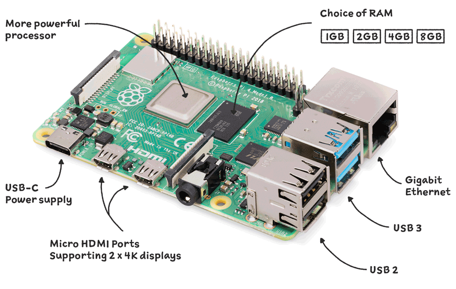

# Using millitome generator on Raspberry Pi 4

*"The Raspberry Pi is a low cost, credit-card sized computer that plugs into a computer monitor or TV, and uses a standard keyboard and mouse."* [more...](https://www.raspberrypi.org/help/what-%20is-a-raspberry-pi/)

While the tool set for millitome generation was developed and tested on MacOS, all its components are cross-platform. At the core of the creation process is the [Openscad](https://openscad.org) application, which is not only available for MacOS, but also for Windows and Linux operating systems. The terminal script, used to control Openscad, *should* run in any bash compatible terminal.

No current Windows or Linux installation was available to test this. But a Raspberry Pi 4 mini computer was available. One of the beauties of this credit-card sized computer is that it runs off of a SD card, which contains the operating system, and any files needed. Many different operating systems are available to be installed in a straight forward process. That means that by simply swapping out an SD card the Raspberry Pi can be turned into a different computer. 

In comparison to the 32GB iMac that was used for development, the Raspberry Pi 4 used for this test has 4GB of RAM and runs off of a 8GB SD card. Despite all expections it worked!

## Hardware

Raspberry Pi 4  
Cooling fan 
Power supply 
Ethernet cable 
8GB micro SD card 
USB keyboard 
Display 
USB mouse 
Cables, adapters 
Computer with access to SD card reader

## Setup

This wep page contains all info needed to perform a successfull installation of Raspberry Pi OS:
[Setting up your Raspberry Pi](https://www.raspberrypi.com/documentation/computers/getting-started.html)
You will use an application called Raspberry Pi Imager to install the OS. In the main menu choose *Raspberry Pi OS (other)* and in the following menu select *Raspberry Pi OS (64-bit)*.

[Raspberry Pi OS](https://www.raspberrypi.com/documentation/computers/os.html#introduction)

## Software Installation

## Running the Software
