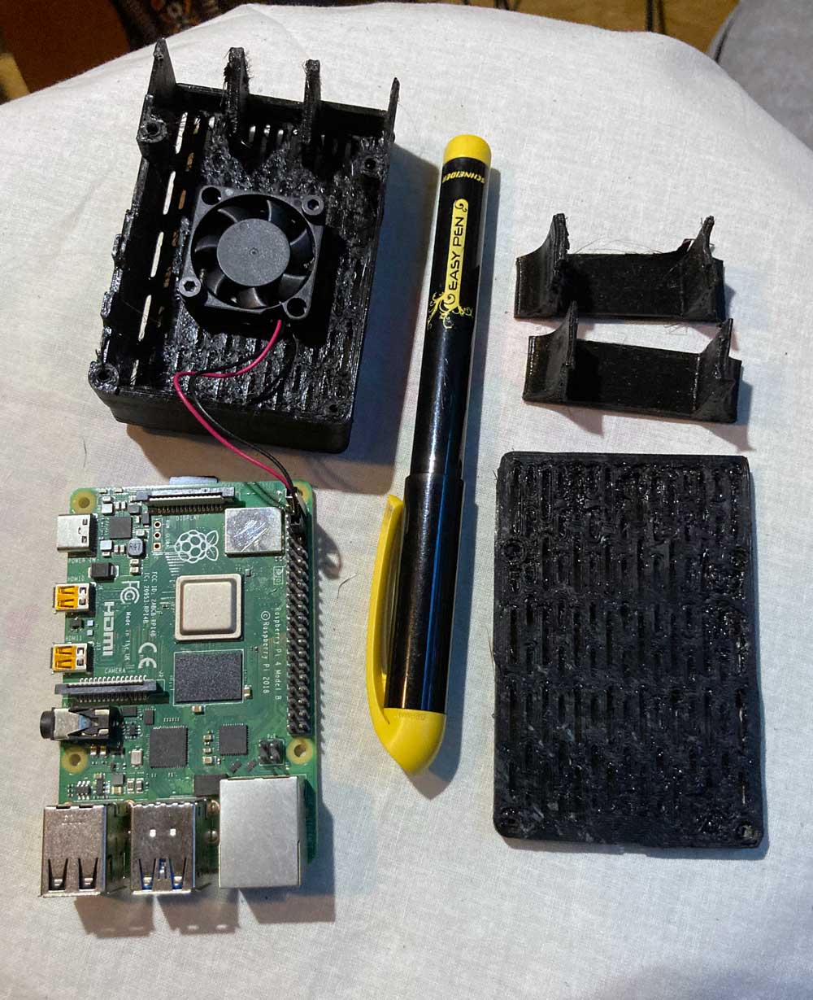
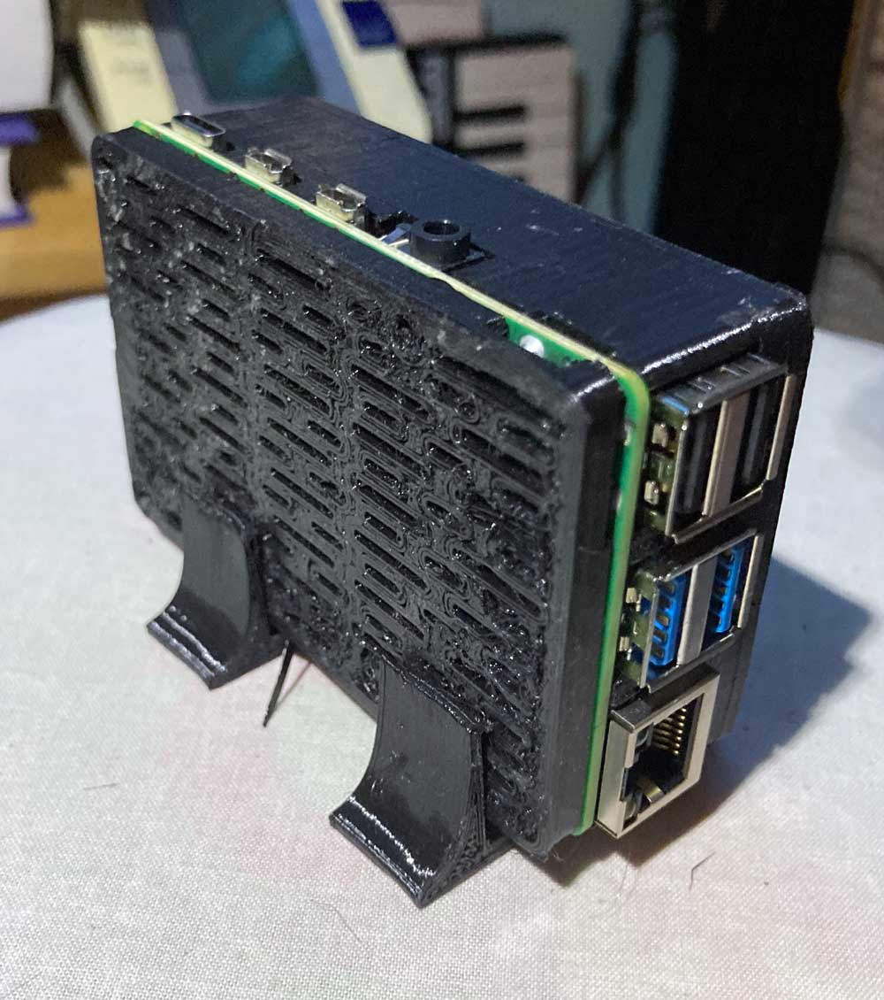
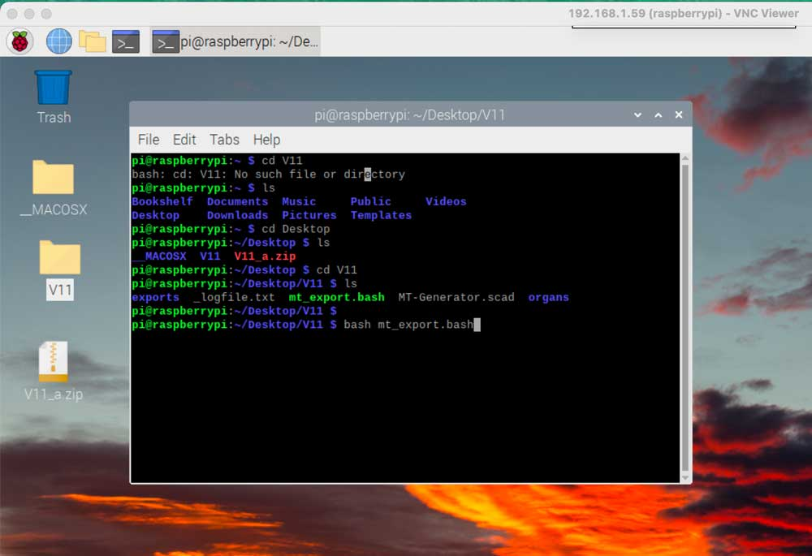

# Using millitome generator on Raspberry Pi 4

*"The Raspberry Pi is a low cost, credit-card sized computer that plugs into a computer monitor or TV, and uses a standard keyboard and mouse."* [more...](https://www.raspberrypi.org/help/what-%20is-a-raspberry-pi/)

While the tool set for millitome generation was developed and tested on MacOS, all its components are cross-platform. At the core of the creation process is the [Openscad](https://openscad.org) application, which is not only available for MacOS, but also for Windows and Linux operating systems. The terminal script, used to control Openscad, *should* run in any bash compatible terminal.

No current computer installation of Windows or Linux was available, so a Raspberry Pi 4 mini computer was used for testing. One of the beauties of this credit-card sized computer is that it runs off of a SD card, which contains the operating system and any files needed. Many different operating systems are available to be installed in a straight forward process. That means that by simply swapping out an SD card the Raspberry Pi can be turned into a different computer. 

In comparison to the 32GB iMac that was used for development, the Raspberry Pi 4 for this test has only 4GB of RAM and runs off of a 8GB SD card. Despite all expections it worked!

## Hardware

Raspberry Pi 4  
Cooling fan 
Power supply 
Ethernet cable 
8GB micro SD card 
USB keyboard 
Display 
USB mouse 
Cables, adapters 
Computer with access to SD card reader

  
  

## Setup

This wep page contains all info needed to perform a successfull installation of [Raspberry Pi OS](https://www.raspberrypi.com/documentation/computers/os.html#introduction): 
[Setting up your Raspberry Pi](https://www.raspberrypi.com/documentation/computers/getting-started.html)

You will use an application called [Raspberry Pi Imager](https://www.raspberrypi.com/software/) on your main computer to install the OS. In the main menu choose *Raspberry Pi OS (other)* and in the following menu select *Raspberry Pi OS (64-bit)*.

After the installation and [configuration](https://www.raspberrypi.com/documentation/computers/getting-started.html#using-raspberry-pi-imager) is completed, the Raspberry Pi 4 can be reached through the ethernet connection or WiFi.

## Software Installation

### Openscad Installation

At this point you can interact with the Pi 4 through an SSH connection from your main computer, screen sharing or directly with attached keyboard, mouse and display.

Raspberry Pi OS is a flavor of Linux and will run the Debian/Ubuntu/Kubuntu version of [Openscad](https://openscad.org/downloads.html). 
To install open the command line terminal and run this command:
*$ sudo apt-get install openscad*

After successfull installation type *$ openscad* at the command line. Openscad should start with an empty code window.

### Millitome Generator Installation

Download [V11.zip](https://github.com/hubmapconsortium/hra-millitome-generator/blob/c095c062690b41a7d22607d2dc9e0563b7a91147/OpenScad%20Code/V11/V11.zip).
This ZIP file contains the work folder with all required files and folders. Save it to the desktop of the Pi 4.
In the command line terminal navigate to the Desktop. Run *$ unzip \<filename\>*

Millitome Generator is now ready to run.

## Running the Software

Instructions are identical to [this](https://github.com/hubmapconsortium/hra-millitome-generator/blob/main/OpenScad%20Code/V11/README.md).
