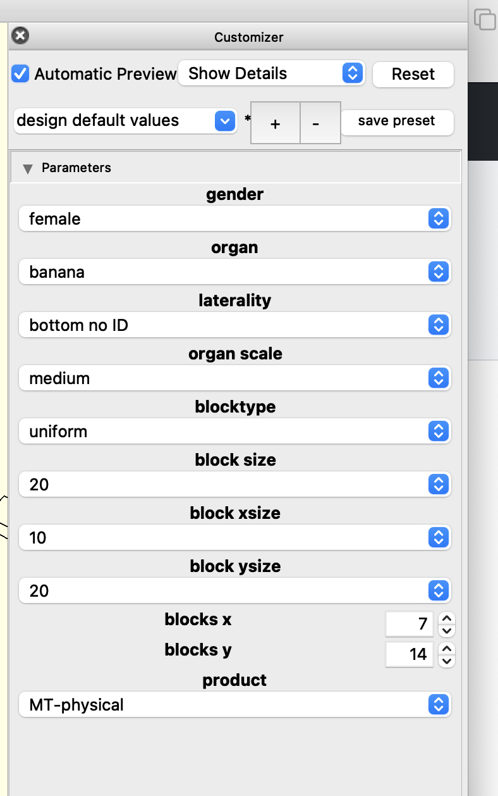

# Millitome Generator Suite V12

2022-9-28

## Tasks

These assets can be created from the Openscad pipeline.

### Millitome physical for 3d print (.STL)

Produces 3d-printable millitomes, based on properties, exported to .STL file. This file can be printed on 3d-printer directly or used as virtual asset.

asset_typeID = 0

### Millitome block array (.STL)

Sample block array used in MT generation process. Used for UI and other virtual things.

asset_typeID = 1

### Millitome sample blocks (.STL)

The actual sample blocks. Created by intersecting block array with the organ model geometry. Used for virtual.

asset_typeID = 2

### Millitome organ (.STL)

The organ model. Used for virtual.

asset_typeID = 3

### Millitome Icebox laser cut sheet (.DXF)

The physical icebox is used to store physical organ samples in a compartmentalized container. The container layout matches the MT layout and provides a column/row coordinate system. Openscad produces a ready-to-use laser cut file in .DXF format.

asset_typeID = 4

### Millitome Icebox 3d model (.STL)

A 3d model of the icebox. Could be 3d printed ot used as virtual asset.

asset_typeID = 5

## Files (code)

### MT-Customizer.scad

Asset properties are set/selected in MT-Customizer or MT-Master, which then runs the appropriate sub-module (MT-Generator, MT-Icebox). Sub-modules can also be launched directly (for testing and debugging), in which case the open properties block has to be un-commented. While the open properties block is un-commented it will NOT run properly when called from MT-Customizer or MT-Master because the the properties in MT-Generator/MT-Icebox will override properties set in the calling app. 

  

  Fig.1 Openscad Customizer for MT production

This program allows configuration of all properties necessary to create Millitome related assets.
The "product" selector determines if a Millitome or an Icebox is produced.

gender [female,male]

organ [kidney_l,kidney_r,spleen,pancreas,banana]

laterality [bottom,top,bottom no ID]

organ scale [large,medium,small]

blocktype [uniform,userXY,blockCount]

block size [10,15,20]

block xsize [10,15,20]

block ysize [10,15,20]

blocks x (int)

blocks y (int)

product [MT-physical,MT-block array,MT-sample blocks,MT-organ,IB-physical,IB-virtual]

To produce .STL/.DXF output the object must be rendered (F6) and saved to the appropriate file format.  

### MT-Customizer.scad

### MT-Generator.scad

This program is run automatically from MT-Customizer if needed. It receives all needed properties from customizer. 
MT-Generator can run as stand-alone program in Openscad but clearly marked property variables in the header must be uncommented to prevent an error.

### MT-Icebox.scad

Same as for MT-Generator.

### mt-organs.config

List of organs MT-Generator knows about. The dimensions and filenames for the organ models are required for proper operation. 3d organ models are kept in a folder named "organs".

### mt-export.bash

Terminal script to produce bulk millitome assets. This has not yet been updated to work with MT-Generator V12.

