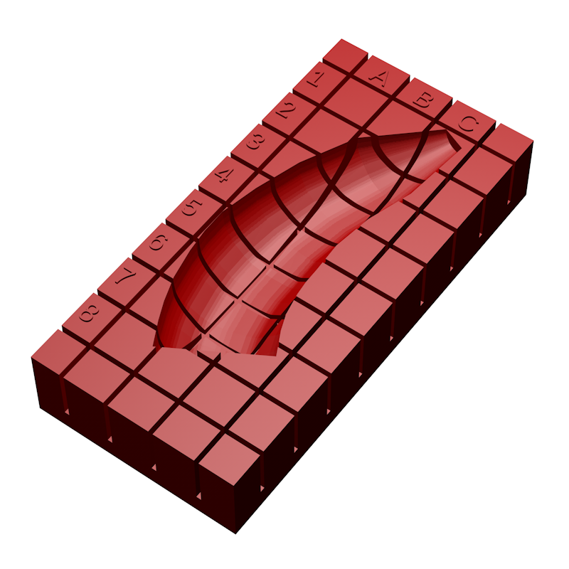
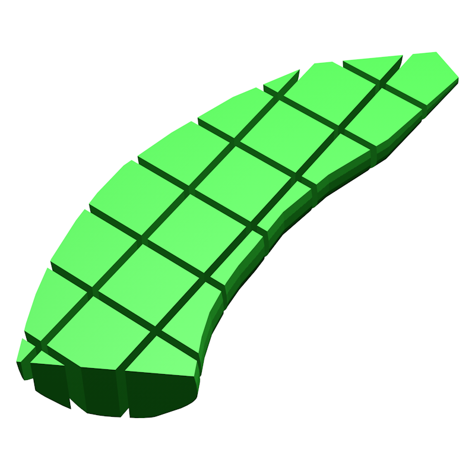
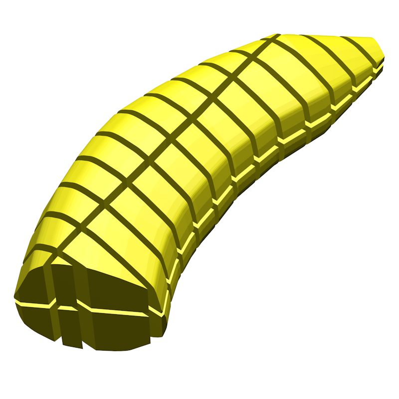
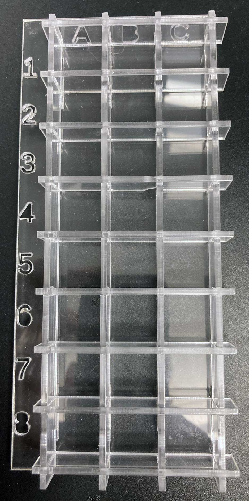
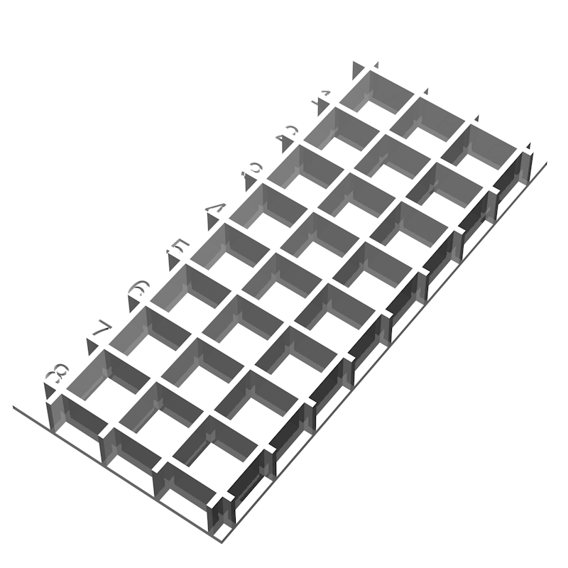
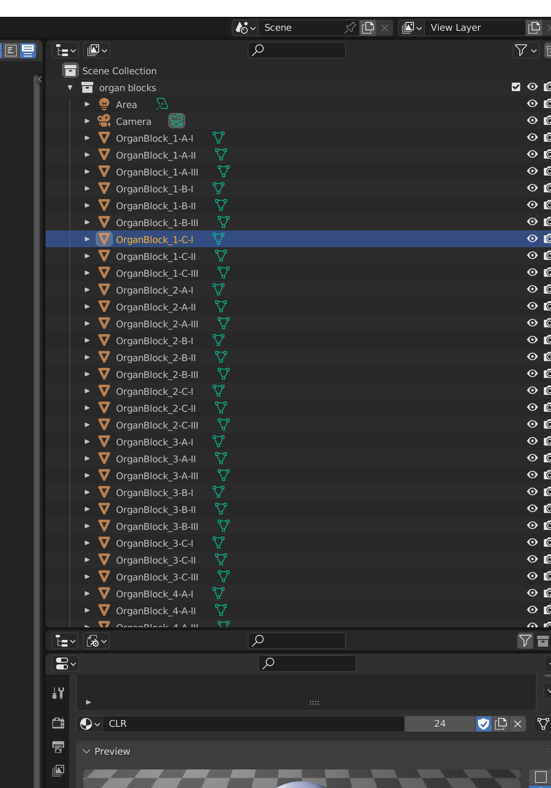
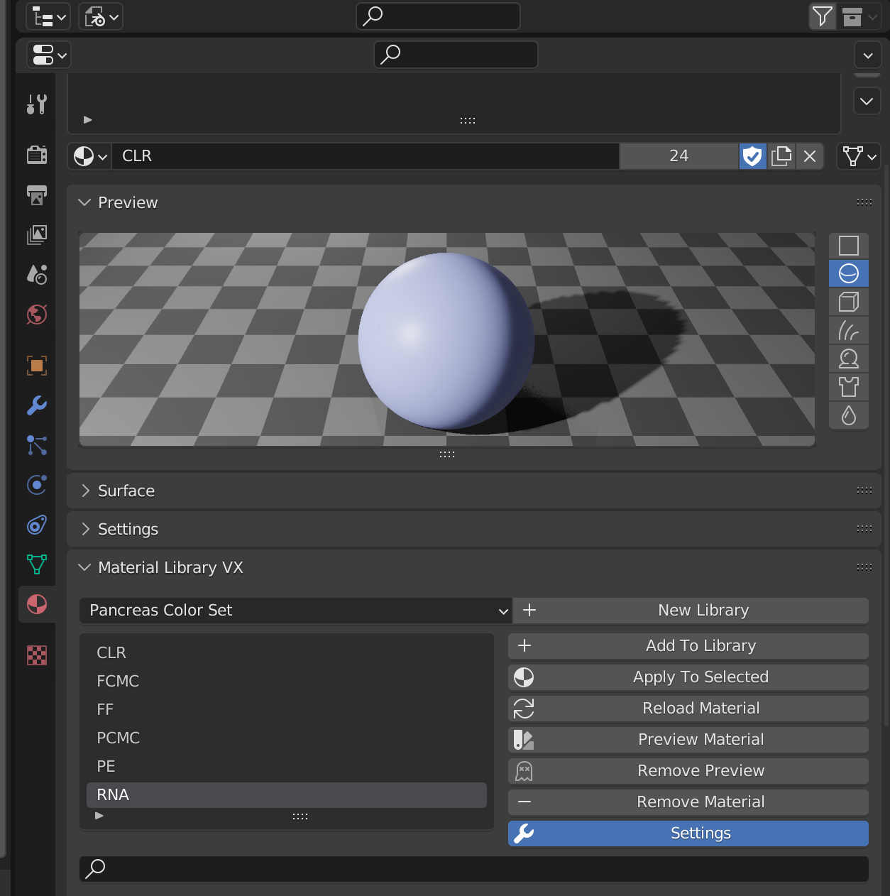

# **Millitome Generator Suite V12**

2022-12-1

## Table of Contents
- [Overview](#toc_overview)
  - [Millitome for 3d print](#toc_mt_print)
  - [Millitome block array](#toc_mt_blockarray)
  - [Millitome organ sample block array](#toc_mt_sampleblocks)
  - [Millitome organ](#toc_mt_organ)
  - [Millitome block array bisection](#toc_mt_fullblock_bisection)
  - [Millitome organ block array bisection](#toc_mt_organ_bisection)
  - [Millitome Icebox laser cut sheet](#toc_icebox_cutsheet)
  - [Millitome Icebox 3d model](#toc_icebox_model)
  - [Millitome Individual block organ 3d models](#toc_organics_organs_models)
  - [Millitome Individual block box 3d models](#toc_organics_boxes_models)
  - [Millitome Individual scaled block bounding box 3d models](#toc_organics_scaled_bbs_models)
- [Files Overview](#toc_files)
  - [Master Apps](#toc_master_apps)
    - [MT-Customizer](#toc_customizer_scad)
    - [MT-Master](#toc_master_scad)
  - [Generator Apps](#toc_generator_apps)
    - [MT-Generator](#toc_generator_scad)
    - [MT-Icebox](#toc_icebox_scad)
    - [MT-Organics](#toc_organics_scad)
  - [Helper Files](#toc_helper_file) 
    - [mt-organs.config](#toc_organs_config) 
    - [mt-export.bash](#toc_export_bash) 
    - [mt-organics.bash](#toc_organics_bash)
  - [Open properties code block](#toc_open_properties)

---

# <a id="toc_overview"></a> **Overview**

[Constructing A Millitome SOP](https://docs.google.com/document/d/1x7tr9LrJfKZmED83aAj_K9FMvmjbxZ883Km93CsrgUM/edit#heading=h.cd53uti4az4)

[Using Millitomes SOP](https://docs.google.com/document/d/1Gdpph-Rx3EkNxe2y1rvhUSNMkFkt6be7DdIL_IeGe-g/edit#heading=h.cd53uti4az4)

The following millitome-related assets can be created from the Openscad pipeline, directly from [MT-Customizer](#customizer-scad) or from [MT-Master](#master-scad) and [MT-Organics](#toc_organics_scad) through a terminal script. 

Note: In this document the word milltiome is sometimes abbreviated to MT.


## <a id="toc_mt_print"></a> Millitome for 3d print

Produces 3d-printable millitomes, based on user-defined properties, exported to .STL file. This file can be printed on a 3d-printer directly or used as virtual asset. Produced with [MT-Generator](#toc_generator_scad). 

<p align="center">
  <span>
  
  
  </span>
</p>
<p align = "center">
  <sub>Fig.1 Millitome for half banana .STL file; physical 3d print</sub>
</p>


## <a id="toc_mt_blockarray"></a> Millitome block array

Sample block array used in the MT generation process. This block array corresponds to the column/row matrix, in this case columns A-C and rows 1-8 on this specific millitome. Exported to .STL file. Virtual asset. Produced with [MT-Generator](#toc_generator_scad).

<p align="center">
  
</p>
<p align = "center">
  <sub>Fig.2 Millitome block array; sample blocks for visual application</sub>
</p>


## <a id="toc_mt_sampleblocks"></a> Millitome organ sample block array

This is created by intersecting the block array with the organ model geometry. Exported to .STL file. Virtual asset. Produced with [MT-Generator](#toc_generator_scad).

<p align="center">
  
</p>
<p align = "center">
  <sub>Fig.3 Millitome sample blocks for visual application; intersection of block array & sample organ</sub>
</p>


  
## <a id="toc_mt_organ"></a> Millitome organ

The organ model is used to form the mold in all of the assets. Exported to .STL file. Virtual asset. Produced with [MT-Generator](#toc_generator_scad).

<p align="center">
  
</p>
<p align = "center">
  <sub>Fig.4 Model of the half banana used to form the mold in the millitome</sub>
</p>


## <a id="toc_mt_fullblock_bisection"></a> Millitome block array bisection

This array contains a complete set of blocks for the full organ. All blocks are combined into a single 3d object. Exported to .STL file. Virtual asset. Produced with [MT-Generator](#toc_generator_scad).

<p align="center">
  
</p>
<p align = "center">
  <sub>Fig.5 Full block array, bisected into two layers</sub>
</p>


## <a id="toc_mt_organ_bisection"></a> Millitome organ block array bisection

The full organ model with all blocks, bisected into top and bottom section. All blocks are combined into a single 3d object. Exported to .STL file. Virtual asset. Produced with [MT-Generator](#toc_generator_scad).

<p align="center">
  
</p>
<p align = "center">
  <sub>Fig.6 Full organ model sliced, diced and bisected into two layers</sub>
</p>


## <a id="toc_icebox_cutsheet"></a> Millitome Icebox laser cut sheet

The physical icebox is used to store organ samples in a compartmentalized container. The container layout matches the grid layout of the millitome and provides the same column/row coordinate system. Openscad produces a ready-to-use laser cut file in .DXF format. Produced with [MT-Icebox](#toc_icebox_scad).

<p align="center">
  
  
</p>
<p align = "center">
  <sub>Fig.7 Left: icebox laser cut sheet; right: physial icebox</sub>
</p>


## <a id="toc_icebox_model"></a> Millitome Icebox 3d model

A 3d model of the icebox. Used as virtual asset but could be 3d printed (although it is not very practical, as it would take a lot of filament and time). Exported to .STL file. Produced with [MT-Icebox](#toc_icebox_scad).

<p align="center">
  
</p>
<p align = "center">
  <sub>Fig.8 3D model of icebox</sub>
</p>


## <a id="toc_organics_organs_models"></a> Millitome Individual block organ 3d models

A 3d model of a specific sample block from a three dimensional, user-defined cutting matrix. Produces one organ sample block of a specified x,y,z coordinate of the cutting matrix. Exported to .STL file. Individual .STL files are imported into Blender for coloring. 3d geometry produced with [MT-Organics](#toc_organics_scad).

<p align="center">
  
</p>
<p align = "center">
  <sub>Fig.9 Banana half; individual organ sample blocks</sub>
</p>


## <a id="toc_organics_boxes_models"></a> Millitome Individual block box 3d models

A 3d model of a specific sample block from a three dimensional, user-defined cutting matrix. Produces one box block of a specified x,y,z coordinate of the cutting matrix. These boxes are all of uniform size. Exported to .STL file. Individual .STL files are imported into a single Blender document for coloring. 3d geometry produced with [MT-Organics](#toc_organics_scad).

<p align="center">
  
</p>
<p align = "center">
  <sub>Fig.10 Banana half; individual uniform blocks</sub>
</p>


## <a id="toc_organics_scaled_bbs_models"></a> Millitome Individual scaled block bounding box 3d models

A 3d model of a specific sample block from a three dimensional, user-defined cutting matrix. Openscad cannot export bounding boxes; a custom Python script in Blender is used to create the bounding boxes from individual organ block .STL files. 3d geometry produced with [MT-Organics](#toc_organics_scad), coloring in Blender.

<p align="center">
  
</p>
<p align = "center">
  <sub>Fig.11 Banana half; individual scale blocks</sub>
</p>


---


# <a id="toc_files"></a> **Files Overview**

<p align="center">
  
</p>
<p align = "center">
  <sub>Fig.12 Production pipeline diagram</sub>
</p>


MT_Generator V12 requires the following files/folders in the same folder:
- [MT-Customizer.scad](#toc_customizer_scad)
- [MT-Master.scad](#toc_master_scad)
- [MT-Generator.scad](#toc_generator_scad)
- [MT-Icebox.scad](#toc_icebox_scad)
- [MT-Organics.scad](#toc_organics_scad)
- [mt_export.bash](#toc_export_bash)
- [mt-organics.bash](#toc_organics_bash)
- [mt-organs.config](#toc_organs_config)
- [organs (folder)](#toc_organs)

In addition the following files/folders are created at runtime:
- [exports (folder)](#toc_exports)
- [_logfile.txt](#toc_logfile)


## <a id="toc_master_apps"></a> **Master Apps**

Asset export properties are set/selected in [MT-Customizer](#customizer-scad) or [MT-Master](#master-scad), which then runs the appropriate sub-module ([MT-Generator](#generator-scad), [MT-Icebox](#icebox-scad)). For testing and debugging, sub-modules can also be launched directly, in which case the [Open Properties Code Block](#toc_open_properties) has to be un-commented. However, while the [Open Properties Code Block](#toc_open_properties) is un-commented, it will NOT run properly when called from [MT-Customizer](#customizer-scad) or [MT-Master](#master-scad), because the properties in [MT-Generator](#generator-scad)/[MT-Icebox](#icebox-scad) will override properties set in the master app.

Master apps will read organ properties from [mt-organs.config](#toc_organs_config) and require STL files of individual organs in the [organs folder](#toc_organs)


## <a id="toc_customizer_scad"></a> MT-Customizer


<p align="center">
  
</p>
<p align = "center">
  <sub>Fig.13 Openscad Customizer for MT production</sub>
</p>

This program allows the configuration of all properties necessary to create one Millitome-related asset at a time. The "product" selector at the bottom determines if a Millitome, an Icebox or a Organ-Bisection is produced. 

With some combinations of properties not all settings are relevant. For example if "blocktype" is set to "uniform", "blocksize" is used to determine the X and Y dimensions of a sample block; in that case "block xsize", "block ysize" and "blocks x" and "blocks y" are ignored.

The following list shows properties available through the [Open Properties Code Block](#toc_open_properties) and exposed for user interaction in the customizer interface:

#### **gender**
1. female
2. male

#### **organ**
1. kidney_l
2. kidney_r
3. spleen
4. pancreas
5. banana (experimental)
6. vb_pancreas (experimental)

#### **laterality**
1. bottom
2. top
3. bottom no ID (bottom half, text markers surpressed)

#### **organ scale**
1. large (115%)
2. medium (100%)
3. small (85%)

#### **blocktype**
1. uniform (i.e. 20x20mm)
2. userXY (i.e. 15x20mm, 35x5mm, etc)
3. blockCount (set number of blocks in X and Y directions)

#### **block size** (for uniform blocktype only)
1. 10
2. 15
3. 20

#### **block xsize** (X size for userXY blocktype only)
1. 10
2. 15
3. 20

#### **block ysize** (Y size for userXY blocktype only)
1. 10
2. 15
3. 20

#### **blocks x** (X number of blocks; blockcount blocktype only)
1. integer

#### **blocks y** (Y number of blocks; blockcount blocktype only)
1. integer

#### **product**
1. MT-physical
2. MT-block array
3. MT-sample blocks
4. MT-organ
5. MT-full block array
6. MT-full organ bisecttion
7. IB-physical
8. IB-virtual


To produce .STL/.DXF output from OpenScad, the object must be rendered (F6 on MacOS) and saved to the appropriate file format.  

Source code: [MT-Customizer.scad](https://github.com/hubmapconsortium/hra-millitome-generator/blob/43b1897e6ac99ccb0851eb02e3b59370aa0d568d/OpenScad%20Code/V12/MT-Customizer.scad)


## <a id="toc_master_scad"></a> MT-Master

Where [MT-Customizer](#customizer-scad) gives the user access to the [Open Properties Code Block](#toc_open_properties) through a simple interface, [MT-Master](#master-scad) serves as a remote control interface for [MT-Generator](#generator-scad) and [MT-Icebox](#icebox-scad). When [MT-Master](#master-scad) is executed by itself, it will call [MT-Generator](#generator-scad) or [MT-Icebox](#icebox-scad) with the properties defined in the [Open Properties Code Block](#toc_open_properties) and produce the requested output.

However, it is designed to serve as a property passthrough interface between [mt-export](#bash-script) and [MT-Generator](#generator-scad) or [MT-Icebox](#icebox-scad). 

[mt-export](#bash-script) will call [MT-Master](#master-scad) repeatedly, as required, to produce millitome assets automatically. To do this, it needs to pass commandline parameters into the OpenScad environment. The names of these parameters must match pre-defined variables in OpenScad; passed-in parameters will override the pre-defined values in the [Open Properties Code Block](#toc_open_properties) of [MT-Master](#master-scad).  

Source code: [MT-Master.scad](https://github.com/hubmapconsortium/hra-millitome-generator/blob/b0c8e3b68240fbd42764fef540e56fcb9db5249e/OpenScad%20Code/V12/MT-Master.scad)

## <a id="toc_generator_apps"></a> **Generator Apps**

The generation of graphics assets takes place in one of the three generator apps. Both, [MT-Generator](#generator-scad) and [MT-Icebox](#icebox-scad), are OpenScad code files which get called from one of the master apps. [MT-Organics](#toc_organics_scad) is called repeatedly from [mt-organics.bash](#toc_organics_bash). In the regular MT production chain no code needs to be accessed here. For debugging either one can be ran as stand-alone app, after un-commenting their [Open Properties Code Block](#toc_open_properties).

## <a id="toc_generator_scad"></a> MT-Generator

This program is called automatically from [MT-Customizer](#customizer-scad) or [MT-Master](#master-scad) if needed. It receives all required properties from the calling master app. 

[MT-Generator](#generator-scad) produces all 3d assets which are created through interaction with the organ model (i.e. Millitome, block arrays, etc.)

[MT-Generator](#generator-scad) can run as stand-alone program in Openscad, for this the [Open Properties Code Block](#toc_open_properties) must be uncommented to prevent runtime errors.

Source code: [MT-Generator.scad](https://github.com/hubmapconsortium/hra-millitome-generator/blob/b0c8e3b68240fbd42764fef540e56fcb9db5249e/OpenScad%20Code/V12/MT-Generator.scad)

## <a id="toc_icebox_scad"></a> MT-Icebox

This program is called automatically from [MT-Customizer](#customizer-scad) or [MT-Master](#master-scad) if needed. It receives all required properties from the calling master app. 

[MT-Icebox](#icebox-scad) produces 3d assets related to the icebox, an optional sample storage container. It can create two types of output: A cut file for laser cutting of physical parts for the box from acrylic sheet material in .DXF format, and an .STL file of the complete assembled box.

[MT-Icebox](#icebox-scad) can run as stand-alone program in Openscad but the [Open Properties Code Block](#toc_open_properties) must be uncommented to prevent runtime errors.

Source code: [MT-Icebox.scad](https://github.com/hubmapconsortium/hra-millitome-generator/blob/b0c8e3b68240fbd42764fef540e56fcb9db5249e/OpenScad%20Code/V12/MT-Icebox.scad)


## <a id="toc_organics_scad"></a> MT-Organics

[MT-Organics](#toc_organics_scad) produces a single specific sample block per run. The organ specifics are set in a properties configuration list. Depending on the asset type set in the properties, either a block from the organ model is produced, or a uniform bounding box, and then exported as .STL file.

The current version does not allow the definition of blocksizes, as do [MT-Generator](#generator-scad) and [MT-Icebox](#icebox-scad). Instead, the user sets the number of requested blocks for each x, y and z. [MT-Organics](#toc_organics_scad) will then calculate the size of each block based on the dimensions of the organ model. The location_x,y,z properties then determine which block from the array is produced. This can potentially produce very small blocks or even no geometry at all, depending on the shape of the organ and the requested block size.

This program runs as a stand-alone or is called from [mt-organics.bash](#toc_organics_bash).

When controlled from [mt-organics.bash](#toc_organics_bash) [MT-Organics](#toc_organics_scad) exports one .STL file per requested block. All blocks of a run are exported to the same, clearly named folder. In the 3x8x3 matrix used in the examples here, 72 individual .STL files are created. Most uses require all blocks of a exported set to be in the same 3d file for post-processing.

Requirements for post-processing apps:
1. Ability to import .STL files (no need to translate file format)
2. Can import multiple files at once (we don't want to import 72 individual files one-by-one)
3. Scripting ability to create scaled bounding boxes
4. Scripting ability to apply color/material patterns

The free [Blender](https://www.blender.org) 3d app fullfills these requirements.

### [Blender](https://www.blender.org) Post Processing

To export combined 3d file:
- Import all .STL block files into a Collection, in one single operation. 
- Save to required format.

<p align="center">
  
</p>
<p align = "center">
  <sub>Fig.13 Imported blocks in Blender Collection; here renamed 'organ blocks'</sub>
</p>


To apply materials:
- Import .STL blocks as before.
- Switch to Scripting Workspace and open or paste [this](https://github.com/hubmapconsortium/hra-millitome-generator/blob/41e272760435baabcaf571832ff99f6901dce323/OpenScad%20Code/V12/Pancreas%20Vanderbilt/Experimenting/Apply%20Materials) Python script:
```
import bpy

# 2022-12-1
# applies materials
# select all organblocks to be treated

numOfMaterials = len(bpy.data.materials)
thisMaterial = 0

for ob in bpy.context.selected_objects:
    bpy.context.view_layer.objects.active = ob
   
    # add material
    mat = bpy.data.materials[thisMaterial]
    ob.data.materials.append(mat)
    
    # make sure materials stay within available range
    thisMaterial += 1
    if (thisMaterial == numOfMaterials):
        thisMaterial = 0
```

Apply a 'Fake User' to the script (otherwise it will get removed after you quit Blender).

- Add the materials to be used. Each material should also have a Fake User to stay persistent. As the Python script goes down the list of blocks it will loop through the list of materials. 

<p align="center">
  
</p>
<p align = "center">
  <sub>Fig.14 Blender materials list as used for example</sub>
</p>

- Select all blocks materials should be applied to and click the RUN button (arrow triangle) in the Scripting window.

To apply scaled bounding boxes and materials:
- Import .STL blocks as before.
- Switch to Scripting Workspace and open or paste [this](https://github.com/hubmapconsortium/hra-millitome-generator/blob/41e272760435baabcaf571832ff99f6901dce323/OpenScad%20Code/V12/Pancreas%20Vanderbilt/Experimenting/Apply%20Bounding%20Boxes%20&%20Materials.py) Python script:

```
import bpy

# 2022-12-1
# apply bounding boxes and materials
# we need PeterBB GeometryNode to do the bounding boxes
# select all organblocks to be treated

numOfMaterials = len(bpy.data.materials)
thisMaterial = 0

for ob in bpy.context.selected_objects:
    bpy.context.view_layer.objects.active = ob
     
    # first add a node
    bpy.ops.object.modifier_add(type='NODES')
    # then pick specific GeometryNode by name (modify the modifier)
    bpy.data.objects[ob.name].modifiers["GeometryNodes"].node_group =  bpy.data.node_groups["PeterBB"]
    # then apply; now we can add material
    bpy.ops.object.modifier_apply(modifier="GeometryNodes")
        
    # add material
    mat = bpy.data.materials[thisMaterial]
    ob.data.materials.append(mat)
    
    # make sure materials stay within available range
    thisMaterial += 1
    if (thisMaterial == numOfMaterials):
        thisMaterial = 0
```

Apply a 'Fake User' to the script (otherwise it will get removed after you quit Blender).

- Add the materials to be used. Each material should also have a Fake User to stay persistent. As the Python script goes down the list of blocks it will loop through the list of materials.
- This script also requires a Geometry Node to make the bounding boxes.


Bounding boxes:
Blender to import and combine STLs into single file
Blender to scale collection (for real size scale to 0.001 as STLs come in at 1000x) 
- select all objects in collection, use Properties and enter x/y/z 0.001 !! confirm each scale with OPTION/ALT-RETURN to apply to all objects
Blender 3+ - Python script to go through list
?????
The following three assets require a more involved generation process. 
1. indiviual block segments are exported as .STL files from OpenScad.  


[MT-Organics](#toc_organics_scad) will read organ properties from [mt-organs.config](#toc_organs_config) and require STL files of individual organs in the [organs folder](#toc_organs)

```
//======properties configuration list. When called from bash script these are overridden
genderID        = 1;    // 0=female, 1=male, needs to be integer selector
organID         = 4;    // index for list lookup

organ_scaleID   = 1;    // 0=large,1=medium,2=small                    
asset_typeID    = 7;    // 6=organblocks, 7=boxblocks

// segment counts along three available axis
count_x          = 3;
count_y          = 8;
count_z          = 3;  

// specific segment to cut (values must not be greater than total segments counts, above)
location_x      = 2;    // wide (A-Z)
location_y      = 2;    // long (1-n)
location_z      = 1;    // high (I-r, roman numerals)
//=======END configuration============
```

Source code: [MT-Organics.scad](https://github.com/hubmapconsortium/hra-millitome-generator/blob/b0c8e3b68240fbd42764fef540e56fcb9db5249e/OpenScad%20Code/V12/MT-Organics.scad)


## <a id="toc_helper_files"></a> **Helper Files**

## <a id="toc_organs_config"></a> mt-organs.config

A list of organs needed by [MT-Generator](#generator-scad), [MT-Icebox](#icebox-scad) and [MT-Organics](#toc_organics_scad). The dimensions and filenames for the organ models are required for proper operation. 3d organ models are kept in a folder named "organs".

Source code: [mt-organs.config](https://github.com/hubmapconsortium/hra-millitome-generator/blob/b0c8e3b68240fbd42764fef540e56fcb9db5249e/OpenScad%20Code/V12/mt-organs.config)


## <a id="toc_export_bash"></a> mt-export.bash

Terminal script to produce bulk millitome assets. This has not yet been updated to work with MT-Generator V12.

Source code: [mt-export.bash](https://github.com/hubmapconsortium/hra-millitome-generator/blob/b0c8e3b68240fbd42764fef540e56fcb9db5249e/OpenScad%20Code/V12/mt_export.bash)


## <a id="toc_organics_bash"></a> mt-organics.bash


Source code: [mt-organics.bash](https://github.com/hubmapconsortium/hra-millitome-generator/blob/b0c8e3b68240fbd42764fef540e56fcb9db5249e/OpenScad%20Code/V12/mt_organics.bash)


## <a id="toc_organs"></a> organs (folder)


Folder: [organs (folder)](https://github.com/hubmapconsortium/hra-millitome-generator/tree/main/OpenScad%20Code/V12/organs)


## <a id=toc_code_details></a> **Code Details**

## <a id="toc_open_properties"></a> Open properties code block


```// Open Properties Block=========
//  these variables must be defined here and are carried into MT-Generator & MT-Icebox
//  in case this is run from a bash script the properties are over-ridden by the parameters passed in

productID       = 6;    // 0=millitome_physical, 1=millitome_blockarray, 2=millitome_sampleblocks, 3=millitome_organ, 4=full_array_bisection, 5=organ_bisection, 6=icebox_physical, 7=icebox_virtual

genderID        = 0;    // 0=female, 1=male, needs to be integer selector
organID         = 5;    // index for list lookup
lateralityID    = 0;    // 0=bottom, 1=top, 2=bypass MT creation      
organ_scaleID   = 1;    // 0=large,1=medium,2=small                    

typeID          = 0;    // 0=fixed block size, 1=user block size, 2=user block count

block_size      = 20 ;  // used for type 0, uniform x/y block size for cubes

block_xsize     = 10;   // used for type 1, different x/y block size
block_ysize     = 20;

blocks_x        = 7;    // used for type 2, number of blocks along x, used for calculated block_size
blocks_y        = 14;   // number of blocks along y

asset_typeID    = 5;    // 0=physical MT, 1=virtual block array, 2=virtual block/organ cut, 3=virtual organ model, 4=blockfull_bisection, 5=organ_bisection, 

output_flag     = 0;    // 0 = ECHO everything, 1 = ECHO insert line only, 2 = ECHO col/row insert ONLY

//===============================
```


