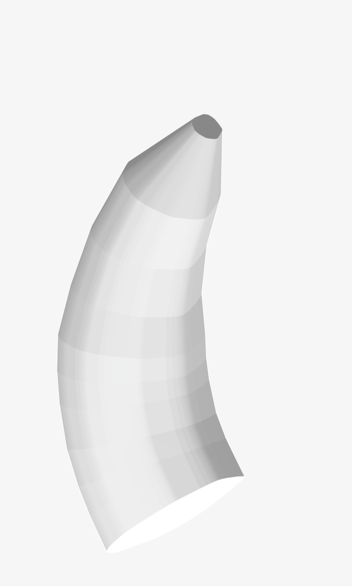

# Millitome Banana

## Assets

The [assets folder](https://github.com/hubmapconsortium/hra-millitome-generator/tree/pbi-banana-ccf/Assets) contains two subfolders:  
[Banana_Full](https://github.com/hubmapconsortium/hra-millitome-generator/tree/pbi-banana-ccf/Assets/VH_Full_Banana) 
[Banana_Half](https://github.com/hubmapconsortium/hra-millitome-generator/tree/pbi-banana-ccf/Assets/VH_Half_Banana) 

**3d-printing the full size banana millitome - VH_M_Banana_20_Medium_Bottom.stl - requires a larger print platform (140mm x 240mm minimum)**

Each subfolder contains the following files. All files are matched in size, scale and orientation to the banana 3d model.

### Banana_Half.stl

Banana model used to create all assets. Based on the scan of a real life banana. No inner structures, materials or textures.

  

### Banana_Half_20_Medium_Bottom.stl

This file goes to the 3d-printer. For the banana half it takes about 24 hours to print and 200g of PLA filament.

  

### Banana_Half_20_Medium_Bottom.csv

Spreadsheet to record sample data.

  

### Banana_Half_20_Medium_Icebox.stl

Icebox refers to a container with matching sample compartments. It shows the column and row labels. This 3d model could be 3d printed but it is much more efficient to laser cut the parts from acrylic (see next item).

  

### Banana_Half_20_Medium_Icebox.dxf

This is a cutsheet which contains all components for the icebox. Acrylic of 2mm thickness is a good material. Parts make very tight connections but may need glue to make water tight.

  

### Banana_Half_20_sample_blocks.stl

This is a 3d asset to be used in a UI. It represents a sectioning of the banana according with the cut pattern of the millitome. Technically it is an intersection of the banana model and the block array (see next item).

  

### Banana_Half_20_block_array.stl

This is the cutting array used in this millitome. 

  

