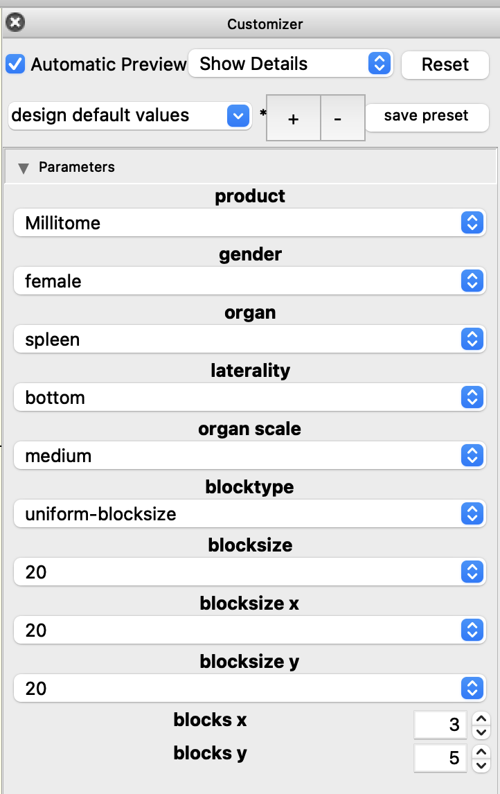
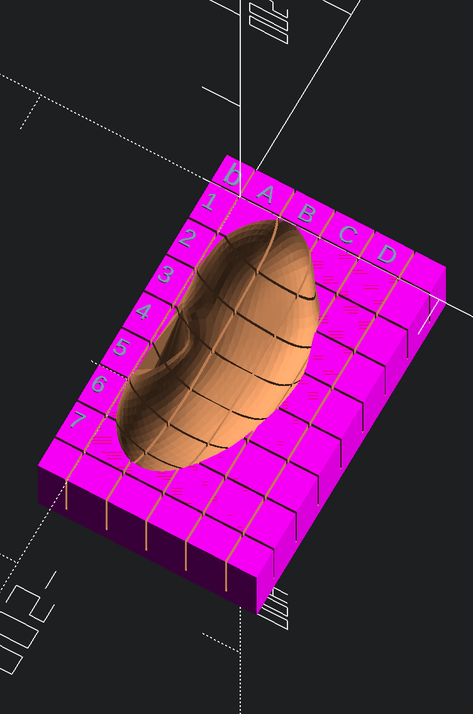
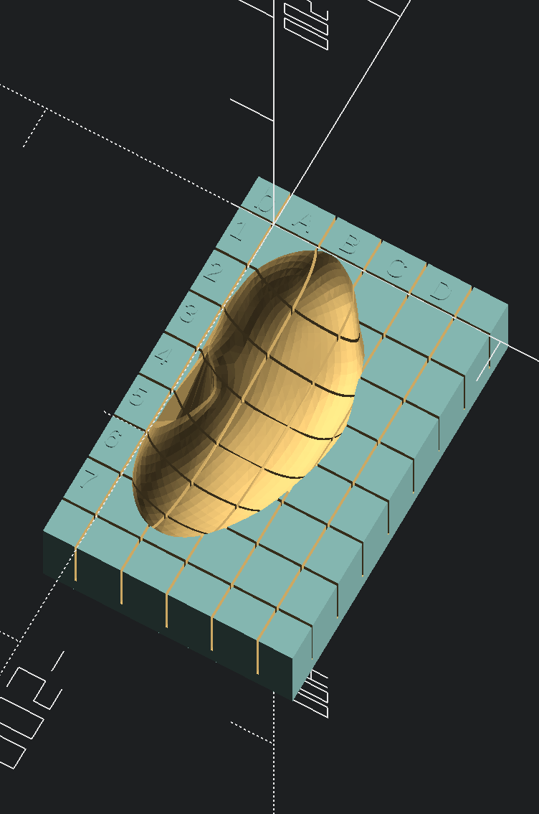
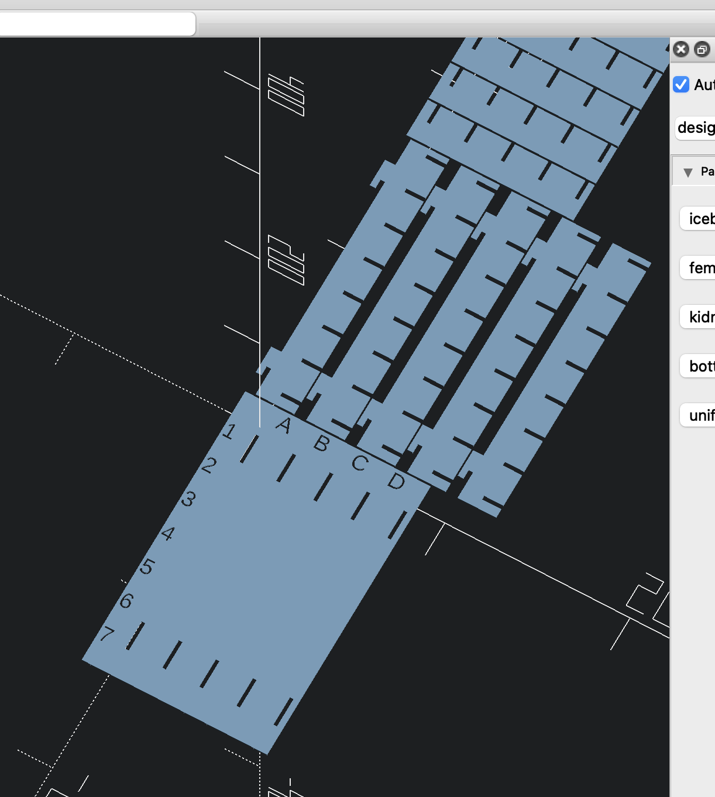
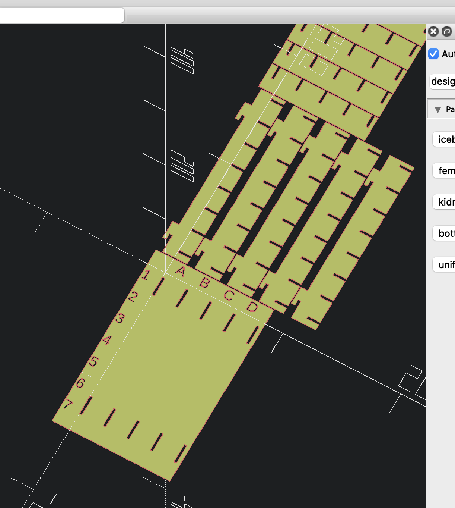
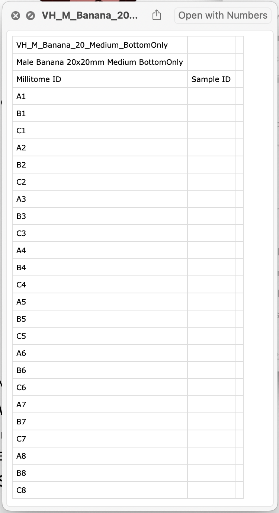

# **Creating Customized Physical Millitome Assets**

## **Millitome for 3D print**

  
  
  
  

## **Icebox for laser-cut acrylic**

  
  

## **Create and Export Customized Asset**
- The [OpenSCAD](https://openscad.org) application must be installed
- Launch "MT-Customizer.scad"
- If Customizer panel is not open, use ->Window->Customizer

  

### **Choose and customize 3D asset**

- product: millitome, icebox
- gender: female, male
- organ
- laterality: top, bottom
- blocktype: uniform-blocksize, XY-blocksize, XY-blockcount
- blocksize: set both X and Y to entered value (used by uniform-blocksize)
- blocksize_x: set X to entered value (used by XY-blocksize)
- blocksize_y: set Y to entered value (used by XY-blocksize)
- blocks_x: number of blocks along X (used by XY-blockcount)
- blocks_y: number of blocks along Y (used by XY-blockcount)
- organscale: 1-nnn percent where 100 is default scale

Note: If Automatic Preview is checked, every change in the Customizer panel will initiate rendering of the requested asset. Some asset configurations such as large iceboxes can take several minutes to preview. To make multiple adjustments in the Customizer panel, it is recommended to uncheck Automatic Preview.

### **Export STL file for 3D print (millitome)**

If the preview of the requested asset is satisfactory, the object needs to be rendered before its geometry can be saved to an STL file.

  

Rendering the object can take several minutes.

  

After successfull render, export asset to STL file.

### **Export DXF file for laser cutting (icebox)**

Rendering an icebox preview takes longer than the corresponding millitome. Otherwise the process is the same.

Icebox asset preview.

  

Rendered icebox asset.

  

After successfull render, export asset to DXF file.

## Matching CSV lookup file

This functionality is currently under revision

  

