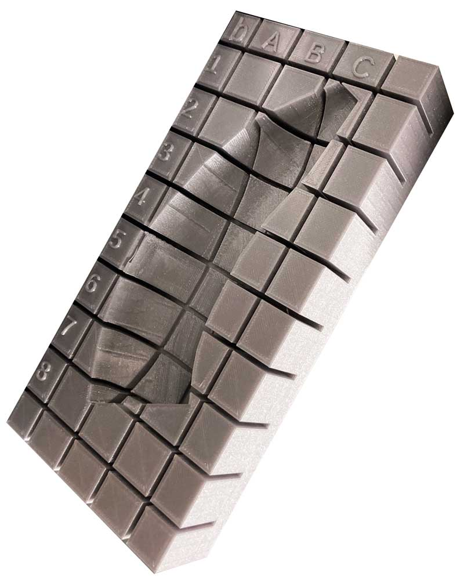
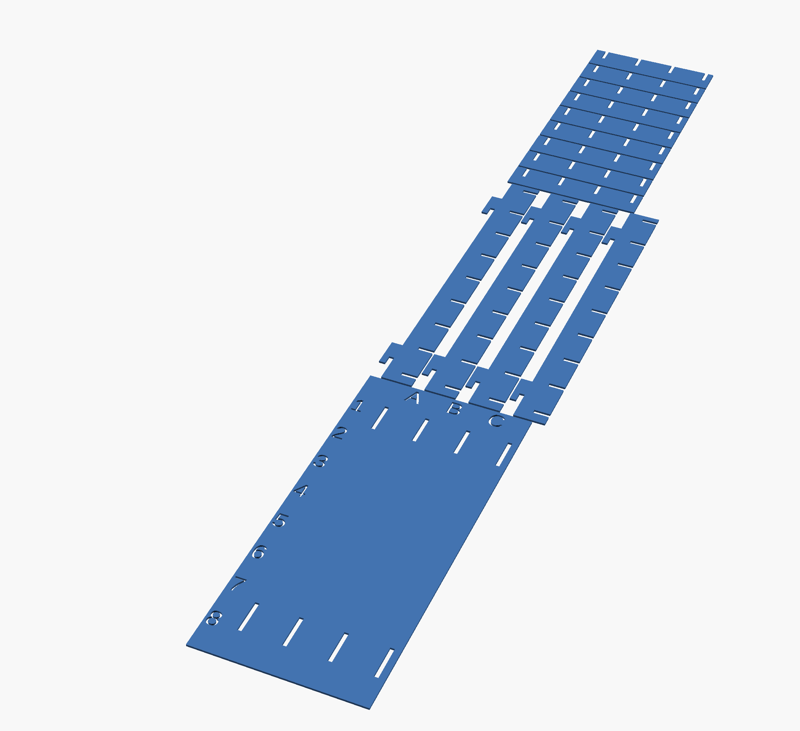

# Millitome Generator

## Function overview

A millitome is a device designed to hold a freshly procured organ and facilitate cutting it into many small tissue blocks for usage in single cell analysis. A millitome has discrete, equally placed cutting grooves in both the x and y directions to guide a carbon steel cutting knife. The millitome is used to produce uniformly sized slices or cubes of tissue material that can be registered to organs from the [CCF 3D Reference Object Library](https://humanatlas.io/3d-reference-library).

Millitome Generator uses modified 3D-models from the HuBMAP organ repository to generate 3D-printable millitomes, delivered as STL files. The exact shape, proportions and dimensions of the generated millitome depend directly on the properties of the organ model used.

---
## What Physical Assets can be created?

### Millitome for 3D print

  
  
  
  

  Fig.1 Millitome for half banana .STL file; physical 3d print

### Icebox for laser-cut acrylic

  
  

  Fig.2 Left: icebox laser cut sheet; right: physial icebox

### Matching CSV lookup file

  

  Fig.3 Lookup sheet in CSV format

 

---
## What Virtual Assets can be created?

### Individual sample block organ segments

  

  Fig.4 Banana half; individual organ sample blocks

### Bounding-boxed organ segments

  

  Fig.5 Banana half; individual bounding boxed blocks

---

## Software Tools

- (required) OpenSCAD
- (optional) 3D editor, for pre-and post processing (Cinema 4D, Blender, Maya)
- (optional) Terminal to run BASH script

---
## How to install from github

All required files and folders can be installed by downloading the [millitome-physical](https://github.com/hubmapconsortium/hra-millitome-generator/tree/main/millitome-physical) or [millitome-blocks](https://github.com/hubmapconsortium/hra-millitome-generator/tree/main/millitome-blocks) folder to your local computer.
(file & folder names are subject to change)

### Files and Folders required for Physical Millitomes

- MT-Customizer.scad
- MT-Generator.scad
- MT-Icebox.scad
- MT-Master.scad
- mt-organs.config
- organs (folder)
- mt_export.bash
- create-customized-mt.md
- README.md

### Files and Folders required for Virtual Sample Blocks

- MT-Pipeline.blend
- MT-Organics.scad
- mt_organics.py
- mt-organs.config
- organs (folder)
- README.md

